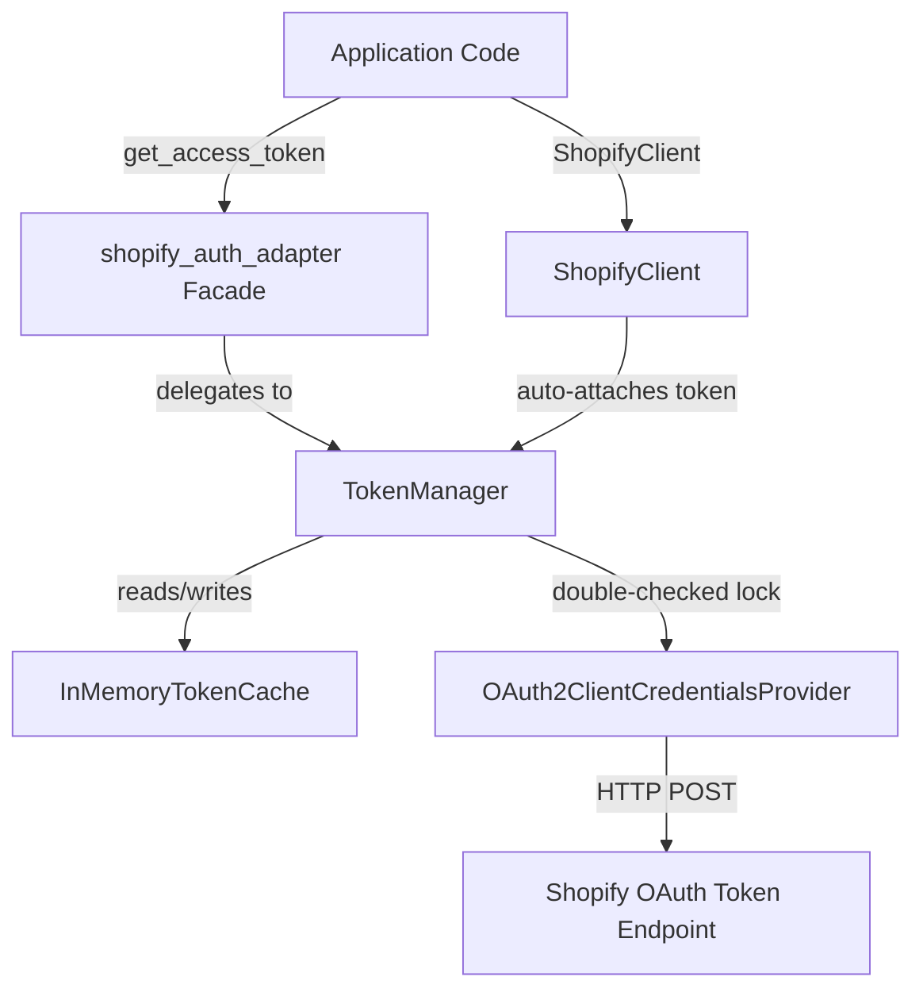

# shopify_auth_adapter

<p align="center">
  <a href="https://github.com/AhmadHassan-BTed/ShopifyAutoAuth/actions/workflows/ci.yml">
    
  </a>
  <a href="https://pypi.org/project/shopify-auth-adapter/">
    
  </a>
  <a href="https://pypi.org/project/shopify-auth-adapter/">
    
  </a>
  <a href="LICENSE">
    
  </a>
</p>

Production-grade Python library providing automatic, thread-safe authentication for the **Shopify Admin API** via the **OAuth 2.0 Client Credentials Grant**.

Designed as an enterprise-ready, drop-in replacement for legacy static `shpat_xxx` access tokens with **zero code refactoring** required for existing applications.

---

## 📖 Contents

- [Why This Library Exists](#-why-this-library-exists)
- [Key Features](#-key-features)
- [Architecture Overview](#-architecture-overview)
- [Installation](#-installation)
- [Environment Configuration](#-environment-configuration)
- [Quick Start](#-quick-start)
  - [1. Drop-in Replacement](#1-drop-in-replacement)
  - [2. High-Level ShopifyClient (REST & GraphQL)](#2-high-level-shopifyclient-rest--graphql)
- [Security & Masking Invariants](#-security--masking-invariants)
- [Development & Testing](#-development--testing)
- [Documentation](#-documentation)
- [License](#-license)

---

## ❓ Why This Library Exists

Since **January 1, 2026**, Shopify no longer allows creating Custom Apps with permanent static `shpat_xxx` tokens in store admin settings. All new applications must use the **Shopify Dev Dashboard** and the **OAuth 2.0 Client Credentials Grant**.

Tokens issued under this flow expire after **24 hours** and must be refreshed programmatically. `shopify_auth_adapter` handles token acquisition, thread-safe in-memory caching, proactive expiration renewal, and HTTP header delegation transparently.

---

## ✨ Key Features

* 🔐 **OAuth 2.0 Client Credentials Grant**: Implements RFC 6749 §4.4 for Shopify Dev Dashboard applications.
* ⚡ **Double-Checked Locking**: Thread-safe token refresh prevents thundering-herd calls under high concurrency.
* ⏱️ **Clock-Skew Buffer Protection**: Proactively refreshes tokens 300 seconds before expiry to prevent transit boundary failures.
* 🛡️ **Zero Credential Leak Guarantee**: Access tokens and client secrets are masked in logs, tracebacks, and `repr` outputs.
* 🔄 **Transparent `LiveToken` Proxy**: A `str` subclass proxy that auto-refreshes headers without breaking static assignment patterns.
* 🌐 **High-Level `ShopifyClient`**: Built-in REST and GraphQL API client with automated 401 retry handling.
* 📦 **PEP 561 Typed**: Full inline static type annotations (`py.typed`).

---

## 🏛️ Architecture Overview



For complete details on domain separation, check [docs/architecture.md](docs/architecture.md) and [docs/system-design.md](docs/system-design.md).

---

## ⚙️ Installation

Install via `pip`:

```bash
pip install shopify-auth-adapter
```

Or install from GitHub:

```bash
pip install git+https://github.com/AhmadHassan-BTed/ShopifyAutoAuth.git
```

---

## 🔑 Environment Configuration

Create a `.env` file in your root directory (see [.env.example](.env.example)):

```ini
SHOPIFY_SHOP=my-store.myshopify.com
SHOPIFY_CLIENT_ID=your_client_id_from_dev_dashboard
SHOPIFY_CLIENT_SECRET=your_client_secret_from_dev_dashboard
SHOPIFY_API_VERSION=2026-07
```

---

## 🚀 Quick Start

### 1. Drop-in Replacement

Replace static token assignment with `get_access_token()`:

```python
from shopify_auth_adapter import get_access_token

# Before:
# SHOPIFY_ACCESS_TOKEN = "shpat_xxxxxxxxx"

# After (automatically refreshes before expiry):
SHOPIFY_ACCESS_TOKEN = get_access_token()

headers = {"X-Shopify-Access-Token": SHOPIFY_ACCESS_TOKEN}
```

### 2. High-Level ShopifyClient (REST & GraphQL)

Use `ShopifyClient` for clean API interactions:

```python
from shopify_auth_adapter import ShopifyClient

shopify = ShopifyClient()

# REST Admin API
blogs = shopify.get("/blogs.json").json()["blogs"]

# GraphQL Admin API
data = shopify.graphql("""
    query {
        blogs(first: 5) {
            edges { node { id title } }
        }
    }
""")
```

---

## 🛡️ Security & Masking Invariants

* **Masked Repr**: Printing `LiveToken` or `CachedToken` outputs `<masked>` or `<redacted>`.
* **In-Memory Only**: Tokens exist only in RAM (`InMemoryTokenCache`) and are never written to disk.
* **HTTPS Strict**: All requests enforce TLS certificate verification.

---

## 🛠️ Development & Testing

This project includes a standardized `Makefile` for developer tooling:

```bash
# Setup editable installation with dev tools
make install

# Run full test suite with coverage
make test

# Run quality checks (linter, format check, typecheck, tests)
make check
```

---

## 📚 Documentation

Detailed technical documentation is available in `docs/`:

* [Architecture Guide](docs/architecture.md)
* [System Design Mechanics](docs/system-design.md)
* [Security Model](docs/security-architecture.md)
* [API Reference](docs/api-reference.md)

---

## 📄 License

Distributed under the MIT License. See [LICENSE](LICENSE) for more information.
