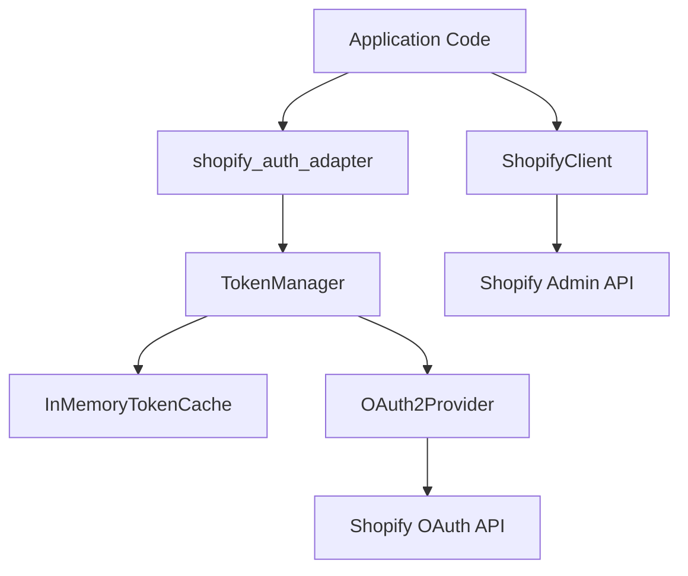

<div align="center">

# shopify_auth_adapter

### Enterprise-Grade Shopify OAuth 2.0 Client Credentials Adapter

[](https://github.com/AhmadHassan-BTed/ShopifyAutoAuth/actions)
[](https://pypi.org/project/shopify-auth-adapter/)
[](https://pypi.org/project/shopify-auth-adapter/)
[](LICENSE)
[-8a2be2?style=for-the-badge)](https://github.com/AhmadHassan-BTed)

---

</div>

## Overview

Shopify deprecated static custom app access tokens (`shpat_xxx`) in favor of short-lived **OAuth 2.0 Client Credentials Grant** tokens.

`shopify_auth_adapter` is a lightweight Python library that handles token acquisition, caching, and auto-refreshing transparently. Existing applications can keep using static access token references without rewriting request logic or managing token expiration.

---

## Key Features

- **Automatic OAuth Handshake**: Exchanges Dev Dashboard API credentials for 24-hour access tokens.
- **Thread-Safe Caching**: In-memory cache with double-checked locking prevents concurrent token fetch stampedes.
- **Proactive Auto-Refresh**: Refresh buffer (5 minutes) ensures tokens never expire mid-request.
- **Drop-In String Proxy**: `LiveToken` proxy plugs directly into standard HTTP headers (`requests`, `httpx`).
- **REST & GraphQL Client**: High-level `ShopifyClient` handles API calls, URL routing, and automatic 401 retries.
- **Zero Credential Leaks**: Automatic string masking on tracebacks and log outputs.

---

## Quick Start

### Installation

```bash
pip install shopify-auth-adapter
```

### 1. Drop-In Token Helper

Set store credentials in environment variables:

```bash
export SHOPIFY_SHOP="your-store.myshopify.com"
export SHOPIFY_CLIENT_ID="your_client_id"
export SHOPIFY_CLIENT_SECRET="your_client_secret"
```

Use `get_access_token()` in your code:

```python
import httpx
from shopify_auth_adapter import get_access_token

headers = {"X-Shopify-Access-Token": get_access_token()}
response = httpx.get(
    "https://your-store.myshopify.com/admin/api/2026-07/shop.json", headers=headers
)
```

### 2. High-Level Shopify Client

```python
from shopify_auth_adapter import ShopifyClient

client = ShopifyClient()

# REST API call
blogs = client.get("/blogs.json").json()["blogs"]

# GraphQL API call
shop_info = client.graphql("""
    query {
        shop {
            name
            email
        }
    }
""")
```

---

## Architecture Overview



---

## Project Structure

```
shopify_auth_adapter_pkg/
├── shopify_auth_adapter/
│   ├── core/                  # Configuration, constants, exceptions, protocols
│   ├── cache/                 # In-memory token cache implementation
│   ├── auth/                  # OAuth2 provider, token manager, LiveToken proxy
│   └── client/                # ShopifyClient REST and GraphQL helper
├── docs/                      # Technical documentation specs
├── tests/                     # Unit and integration test suite
├── pyproject.toml             # Build and tool configuration
└── README.md                  # Project overview
```

---

## License

This project is licensed under the [MIT License](LICENSE).

---

<div align="center">

**Engineered by Ahmad Hassan (B-Ted)**

[GitHub](https://github.com/AhmadHassan-BTed) • [PyPI](https://pypi.org/project/shopify-auth-adapter/) • [LinkedIn](https://www.linkedin.com/in/ahmad-hassan-52ab4225b/)

</div>
