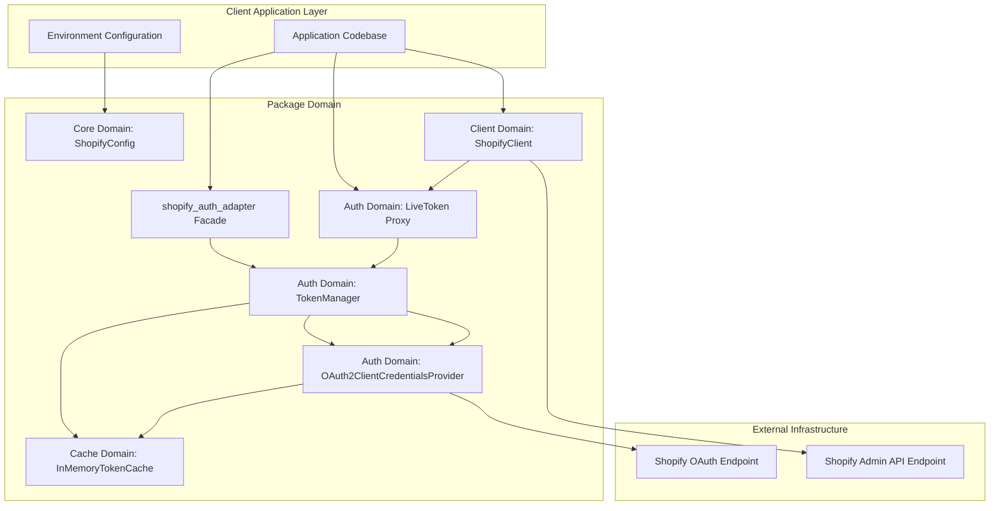
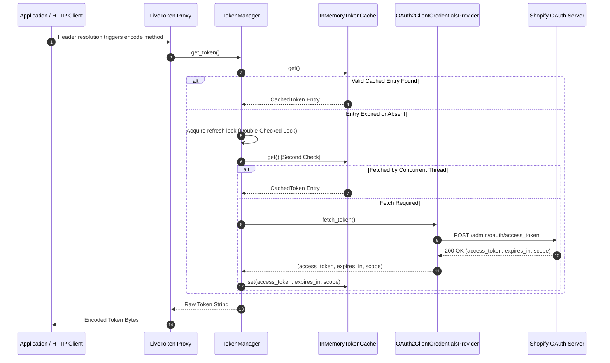
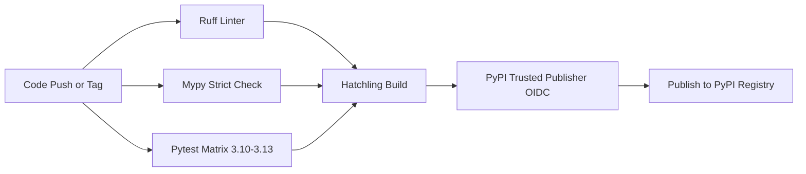

<div align="center">

# shopify_auth_adapter

### Enterprise-Grade Shopify OAuth 2.0 Client Credentials Adapter

*A zero-friction, production-hardened bridge connecting legacy Shopify applications to modern Client Credentials Grant authentication.*

[](https://github.com/AhmadHassan-BTed/ShopifyAutoAuth/actions)
[](https://pypi.org/project/shopify-auth-adapter/)
[](https://pypi.org/project/shopify-auth-adapter/)
[](LICENSE)
[-8a2be2?style=for-the-badge)](https://github.com/AhmadHassan-BTed)

---

</div>

## Overview

Following Shopify's mandatory authentication migration on **January 1, 2026**, static `shpat_xxx` custom app tokens were deprecated in favor of **OAuth 2.0 Client Credentials Grant** short-lived access tokens (RFC 6749 §4.4).

`shopify_auth_adapter` provides a transparent authentication proxy. Applications maintain static variable access syntax (`SHOPIFY_ACCESS_TOKEN = get_access_token()`), while under the hood tokens are acquired, cached in volatile memory, and refreshed prior to expiration without runtime interruption.

---

## Quick Start

### Installation

```bash
pip install shopify-auth-adapter
```

### Setting Up Credentials

You can supply your Shopify Dev Dashboard credentials in **any of 3 ways**:

#### Option A: In a `.env` file (Recommended for Local Dev)
Create a `.env` file in your project root:
```env
SHOPIFY_SHOP=your-store.myshopify.com
SHOPIFY_CLIENT_ID=your_client_id
SHOPIFY_CLIENT_SECRET=your_client_secret
```

#### Option B: Environment Variables (Production / Docker / Cloud)
Set variables in your terminal or deployment environment:
```bash
export SHOPIFY_SHOP="your-store.myshopify.com"
export SHOPIFY_CLIENT_ID="your_client_id"
export SHOPIFY_CLIENT_SECRET="your_client_secret"
```

#### Option C: Pass Directly in Python Code
```python
from shopify_auth_adapter import get_access_token

token = get_access_token(
    shop="your-store.myshopify.com",
    client_id="your_client_id",
    client_secret="your_client_secret",
)
```

---

### Usage Examples

#### 1. Drop-In Token Helper

```python
import httpx

from shopify_auth_adapter import get_access_token

# Automatically reads credentials from .env or environment variables:
headers = {"X-Shopify-Access-Token": get_access_token()}
response = httpx.get(
    "https://your-store.myshopify.com/admin/api/2026-07/shop.json",
    headers=headers,
)
```

#### 2. High-Level Shopify Client

```python
from shopify_auth_adapter import ShopifyClient

# Automatically attaches tokens and retries on 401:
client = ShopifyClient()

# REST API call
blogs = client.get("/blogs.json").json()["blogs"]

# GraphQL API call
shop_info = client.graphql("""
    query {
        shop {
            name
            email
        }
    }
""")
```

---

## Feature Matrix

| Domain | Capability | Architectural Mechanism |
| :--- | :--- | :--- |
| **Authentication** | OAuth 2.0 Client Credentials Grant | Automatic `POST /admin/oauth/access_token` exchange for Dev Dashboard apps. |
| **Concurrency** | Thundering Herd Protection | Re-entrant `threading.RLock` double-checked locking mechanism. |
| **Resilience** | Clock-Skew Mitigation | 300-second (5-minute) proactive expiration cutoff buffer. |
| **Header Integration**| Transparent `LiveToken` Proxy | Custom `str` subclass executing JIT encoding delegation during HTTP header resolution. |
| **Client Abstraction**| High-Level `ShopifyClient` | Integrated REST & GraphQL client with automatic 401 cache-invalidation and single retry. |
| **Security** | Zero Credential Leak Guarantee | String masking on `repr`, `str`, and tracebacks (`LiveToken(<masked>)`). |

---

## System Architecture & Domain Boundaries

The codebase follows domain-driven modularity principles with contract-based interfaces (`Protocol`) to guarantee zero coupling and total separation of concerns.



---

## Request Lifecycle & Token Resolution

The diagram below illustrates the exact sequence executed when an HTTP request header formats the `LiveToken` string proxy:



---

## Repository Structure

```
shopify_auth_adapter_pkg/
├── .github/                       # GitHub Actions workflows & community templates
│   ├── ISSUE_TEMPLATE/            # Structured issue forms (bug_report.yml, etc.)
│   ├── workflows/                 # CI/CD pipelines (ci.yml, release.yml, security.yml)
│   ├── dependabot.yml             # Weekly dependency update configuration
│   └── PULL_REQUEST_TEMPLATE.md   # Standardized pull request template
├── docs/                          # In-depth technical documentation
│   ├── architecture.md            # Domain layout & Mermaid sequence diagrams
│   ├── system-design.md           # Token lifecycle, clock skew & locking mechanics
│   ├── security-architecture.md   # Security model & credential masking rules
│   └── api-reference.md           # Complete public Python API specification
├── shopify_auth_adapter/          # Primary Python package
│   ├── __init__.py                # Package facade (100% backward compatible)
│   ├── py.typed                   # PEP 561 static type marker
│   ├── core/                      # Core domain (config, constants, exceptions, protocols)
│   ├── cache/                     # Cache domain (model, memory cache implementation)
│   ├── auth/                      # Auth domain (OAuth2 provider, manager, LiveToken proxy)
│   └── client/                    # Client domain (ShopifyClient REST/GraphQL helper)
├── tests/                         # Test suite
│   ├── conftest.py                # Global pytest fixtures and mocks
│   ├── unit/                      # Unit tests grouped by domain module
│   └── integration/               # End-to-end integration tests
├── .editorconfig                  # Code formatting guidelines across editors
├── .env.example                   # Environment configuration template
├── .gitattributes                 # Git text normalization and path attributes
├── .gitignore                     # Minimal tracking exclusion rules
├── CHANGELOG.md                   # Keep a Changelog release history
├── CODE_OF_CONDUCT.md             # Contributor Covenant Code of Conduct
├── CONTRIBUTING.md                # Development setup & contributor guidelines
├── Dockerfile                     # Multi-stage container build file
├── docker-compose.yml             # Local docker development environment
├── LICENSE                        # MIT License
├── Makefile                       # Standardized command shortcuts
├── pyproject.toml                 # Packaging & tool configurations (hatchling, ruff, mypy)
├── ROADMAP.md                     # Project strategic goals
└── SUPPORT.md                     # Community help & support guidance
```

---

## Technical Deep Dives

<details>
<summary><b>Clock-Skew Math & Expiration Buffer</b></summary>

<br />

Shopify Client Credentials Grant tokens carry a fixed duration of **86,399 seconds (~24 hours)**.

To prevent edge cases where a token is valid when read from cache but expires while in flight across the network, the expiration cutoff is calculated as:

$$\text{Cutoff} = T_{\text{expiry}} - 300\text{ seconds}$$

Any token within 5 minutes of expiration is treated as invalid, forcing a fresh token fetch prior to request dispatch.
</details>

<details>
<summary><b>Security Invariants & Token Masking</b></summary>

<br />

Credentials and raw access tokens are strictly protected against unintentional exposure in logs, error reports, and inspection tools:

- `repr(LiveToken)` returns `"LiveToken(<masked>)"`.
- `repr(ShopifyConfig)` outputs `client_secret=<redacted>`.
- `repr(CachedToken)` outputs `access_token=<redacted>`.
- Exception messages exclude credential strings under all circumstances.
</details>

<details>
<summary><b>Development & Tooling Shortcuts</b></summary>

<br />

Common developer tasks are managed via the project `Makefile`:

```bash
# Install editable package with dev tools
make install

# Run linter and type checks
make lint
make typecheck

# Run full test suite with coverage
make test
```
</details>

---

## Build & CI/CD Pipeline

The project utilizes GitHub Actions for continuous quality verification and release automation:



---

## License

This project is licensed under the terms of the [MIT License](LICENSE).

---

<div align="center">

**Engineered by Ahmad Hassan (B-Ted)**

[GitHub Profile](https://github.com/AhmadHassan-BTed) • [PyPI Package](https://pypi.org/project/shopify-auth-adapter/) • [LinkedIn](https://www.linkedin.com/in/ahmad-hassan-52ab4225b/)

</div>
