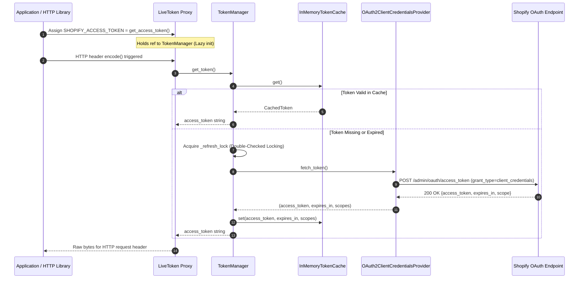

# Enterprise System Architecture

This document details the architectural layout, design principles, and component boundaries of `shopify_auth_adapter`.

---

## 🏛️ High-Level Design Principles

`shopify_auth_adapter` is engineered according to enterprise domain-driven architecture standards:

1. **Functional Cohesion & Single Responsibility**: Every sub-package and module handles exactly one domain responsibility (e.g. `cache` manages memory, `auth` manages OAuth2 handshake, `core` manages configuration and protocols).
2. **Zero Coupling via Protocol Contracts**: Core components interact exclusively via abstract Python `Protocol` interfaces (`TokenCacheProtocol`, `AuthProviderProtocol`, `TokenManagerProtocol`), enabling clean dependency inversion and modular replacement.
3. **100% Backward Compatibility Facade**: The top-level package (`shopify_auth_adapter/__init__.py`) exposes all legacy entry points (`get_access_token`, `ShopifyClient`, `ShopifyConfig`) while routing internal execution to decoupled domain layers.

---

## 📦 Package Domain Boundaries

```
shopify_auth_adapter/
├── __init__.py                # Top-level API Facade
├── py.typed                   # PEP 561 Static Type Marker
│
├── core/                      # Core Domain Layer
│   ├── config.py              # ShopifyConfig Value Object & Environment Parsing
│   ├── constants.py           # System Constants (Buffers, Timeouts, API Versions)
│   ├── exceptions.py          # Custom Exception Hierarchy
│   └── protocols.py           # Abstract Protocols / Interfaces (Contracts)
│
├── cache/                     # Cache Domain Layer
│   ├── model.py               # CachedToken Value Object with Expiration Math
│   └── memory.py              # Thread-Safe InMemoryTokenCache Implementation
│
├── auth/                      # Authentication Domain Layer
│   ├── provider.py            # OAuth2ClientCredentialsProvider (HTTP Fetcher)
│   ├── manager.py             # TokenManager (Double-Checked Locking Lifecycle)
│   └── proxy.py               # LiveToken Transparent Header Proxy
│
└── client/                    # High-Level API Client Layer
    └── client.py              # ShopifyClient REST & GraphQL Client
```

---

## 🔄 Interaction Sequence Diagram



---

## 🔑 Key Abstractions & Interfaces

### 1. `TokenCacheProtocol` (`shopify_auth_adapter.core.protocols`)
```python
class TokenCacheProtocol(Protocol):
    def get(self) -> Optional[CachedToken]: ...
    def set(self, access_token: str, expires_in: int, scopes: str = "") -> CachedToken: ...
    def invalidate(self) -> None: ...
    def is_valid(self) -> bool: ...
```

### 2. `AuthProviderProtocol` (`shopify_auth_adapter.core.protocols`)
```python
class AuthProviderProtocol(Protocol):
    def fetch_token(self) -> tuple[str, int, str]: ...
```

### 3. `TokenManagerProtocol` (`shopify_auth_adapter.core.protocols`)
```python
class TokenManagerProtocol(Protocol):
    def get_token(self) -> str: ...
    def invalidate(self) -> None: ...
```
